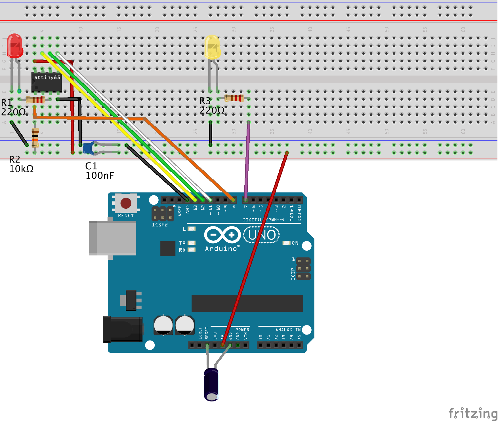
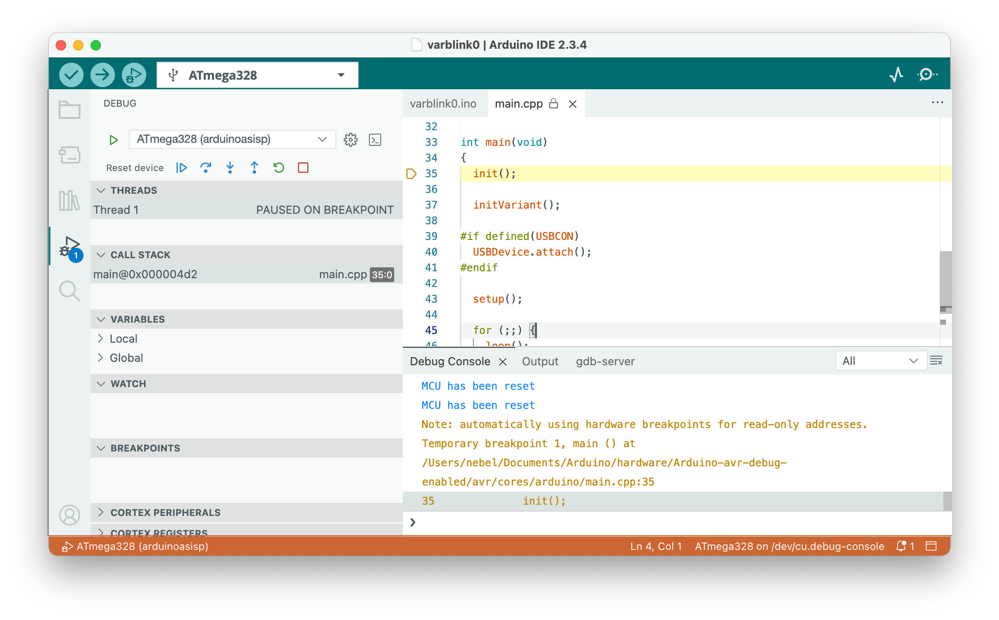

## Quickstart guide: SNAP & ATtiny85

This quickstart guide demonstrates how to use the Arduino IDE 2 for debugging on an ATtiny85 using the MPLAB SNAP debug probe.

### Required hardware

* SNAP
* USB cable
* ATtiny85 (or any other classic ATtiny or ATmegaX8) as the *target*
* In order to set up the target, you need:
    * a breadboard together with
    * 11 jumper wires (male-to-male)
    * 1 LED
    * 2 resistors (10 kΩ, 1kΩ)
    * 1 capacitor (100 nF)

### Step 1: Install the debug-enabled TinyCore

Add a new *boards manager URL* in the `Preferences` dialog:

	https://mcudude.github.io/TinyCore/package_MCUdude_TinyCore_index.json
{!details-boards-manager-url.md!}

Next you have to install the new core. Activate the `Boards Manager`, select `TinyCore`, and click on `Install`.

{!details-install-core.md!}

!!! info "Linux systems"
    After the installation, users of Linux systems will need to add `udev` rules. Download [https://pyavrocd.io/99-edbg-debuggers.rules](https://pyavrocd.io/99-edbg-debuggers.rules), edit if you want, and copy to `/etc/udev/rules.d/`.

### Step 2: Connect target with debug probe

You need to set up the hardware on a breadboard and use six wires to connect the ATtiny to your Uno, turned into a debug probe. Note that the notch or dot on the ATtiny is oriented towards the left.

In reality, this could be like in the following photo.

Here is a table of all connections to check that you have made all the connections.

| ATtiny pin#  | Arduino Uno pin | component                                                    |
| ------------ | --------------- | ------------------------------------------------------------ |
| 1 (Reset)    | D8              | 10k resistor to Vcc                                          |
| 2 (D3)       |                 |                                                              |
| 3 (D4)       |                 | 220 Ω resistor to target (red) LED (+)                       |
| 4 (GND)      | GND             | red and yellow LED (-), decoupling cap 100 nF, RESET blocking cap of 10µF (-) |
| 5 (D0, MOSI) | D11             |                                                              |
| 6 (D1, MISO) | D12             |                                                              |
| 7 (D2, SCK)  | D13             |                                                              |
| 8 (Vcc)      | 5V              | 10k resistor, decoupling cap 100 nF                          |
| &nbsp;       | RESET           | RESET blocking cap of 10 µF (+)                              |
| &nbsp;       | D7              | 220 Ω to system (yellow) LED (+)                             |

The yellow LED is the *system LED*, and the red one is the *ATtiny-LED*. The system LED gives you information about the internal state of the debugger:

1. debugWIRE mode disabled (LED is off),
2. waiting for power-cycling the target (LED flashes every second for 0.1 sec)
3. debugWIRE mode enabled (LED is on),
4. ISP programming (LED is blinking slowly),
5. error state, i.e., not possible to connect to target or internal error (LED blinks furiously every 0.1 sec).

### Step 4: Start Debugging

- Load the sketch you want to debug into the IDE by choosing `Open...` in the `File` menu.
- Select `ATtiny25/45/85` as the board under `Tools` -> `Board` -> `TinyCore`.
- In the `Tools` menu,  choose `1 MHz (internal)` as the `Clock Source`  (assuming that the ATtiny is as it comes from the factory and no fuse has been changed).
- In the `Sketch` menu, select `Optimize for Debugging`.
- Compile the code by clicking the `Verify` button in the upper left corner.
- Open the debug panes by clicking the debug symbol (bug with triangle) in the left sidebar.
- Click the debug symbol in the top row to start debugging. This will start the debugger and the debug server. The activities are logged in the `Debug Console` and the `gdb-server` console in the bottom right part of the window.
- You will probably be asked to "power-cycle the target." This means that you need to remove power from the target and then reconnect it, activating the debugWIRE mode.
- After the debugger and GDB server have been started, the debugger will start executing the program on the target. Execution will stop at the first line of the `main` function.
- Now, you are in business and can set breakpoints (clicking left of the line number), continue executing, stop the program asynchronously, inspect and change values, and examine different stack frames. To terminate your debugging session, click the red box in the debug row before terminating the debugging session.

Be aware that after finishing the debug session, the MCU is still in debugWIRE mode! You can change that by typing `monitor debugwire disable` in the last line of the `Debug Console`.

### After debugging has finished

When you are done with debugging, you probably want to disable the debugWIRE mode again, because in debugWIRE mode, you cannot use the RESET line or ISP programming. This can be accomplished by using the command `monitor debugwire disable` before you leave the debugger. In addition, you should disable the `Optimize for Debugging` setting because it will, in general, generate more code.

So, after everything has been debugged, what do you do with your newly built debug probe? You don't have to throw it away. You can also use it as an ISP programmer (STK500 v1). In the Arduino IDE, such a programmer is called `Arduino as ISP`.

### What can go wrong?

There is always the chance that something goes south, either debugging does not start at all, or something funny happens while debugging. If so, it is a good idea to have a look at the output in the `gdb-server` console. Messages with the prefix [WARNING] often tell what went wrong. If the status LED is blinking very fast, it means that the debugger has hit an unrecoverable error. Type `monitor info` into the last line of the `Debug Console` in order to find out about the [error number](troubleshooting.md#internal-and-fatal-dw-link-errors). It may also be a good idea to consult the [Troubleshooting](troubleshooting.md) and the [Limitations](limitations.md) sections.

